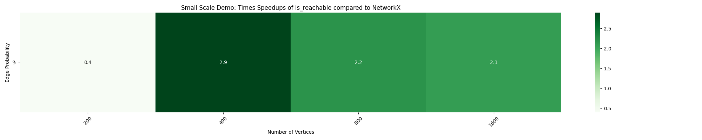
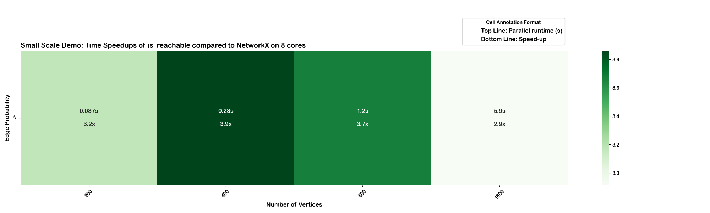
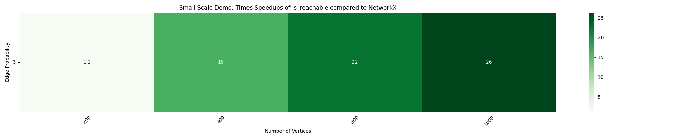
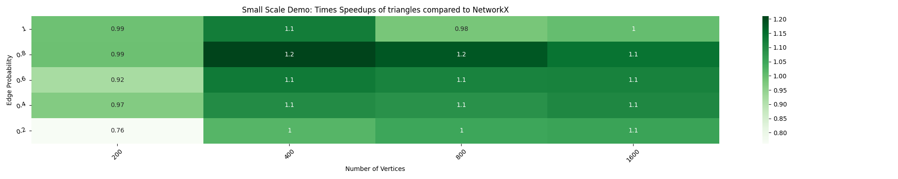
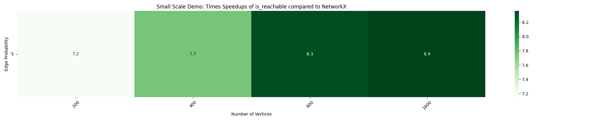

# Blog1 
## Week 1-2 (2nd June to 15th June, 2025)

### 1. Improving the timing script

The [issue#51](https://github.com/networkx/nx-parallel/issues/51) reports inconsistencies in the timing script. For example, in some cases, the rate of speedup would decrease as the number of nodes increased, or speedups would decrease on increasing the number of cores—behavior that contradicts typical expectations of parallel performance. Normally, parallel algorithms are expected to scale better with larger graphs due to increased workload distribution across cores.

The discussion in the issue suggested switching from time.time(), so I started exploring other timing methods. One reason to avoid time.time() is that, under certain conditions (like clock sync or rounding), it can return a lower value on a subsequent call. More importantly, it lacks the precision needed for benchmarking small, fast functions. I initially considered time.perf_counter() for its high-resolution and monotonic behavior. However, as my mentors pointed out, while perf_counter() is good for single measurements, it doesn't help with repeated trials or outlier filtering. Though system interference can't be entirely removed, better measurement strategies help reduce its impact and give more reliable performance estimates.

To address this, I switched to Python’s built-in timeit.repeat() function. This is commonly used for benchmarking because it runs code multiple times and helps mitigate system noise.

In addition to showing speedups, I enhanced the visualizations to also display the actual runtime of the parallel implementation, providing a more complete picture of performance. Since speedup = sequential_time / parallel_time, the sequential runtime can also be estimated by multiplying parallel time with the speedup for comparison. I modularized the script by splitting it into two main functions—one for benchmarking based on function type, and another for plotting heatmaps. I also reduced redundancy in the timing logic and bipartite-specific code. For improved clarity, I added elements to the visualization like a legend and the number of cores used.

To illustrate the improvements, here’s a side-by-side comparison of the previous and updated heatmaps for the `is_reachable` function: 
<p float="left">
  
  
</p>

Despite these fixes, I still observed inconsistent speedups for certain functions, particularly `is_reachable` and `betweenness_centrality`. In both cases, speedups would initially increase with the number of nodes, but eventually plateau or even degrade at larger scales. This was unexpected, especially since parallel performance is supposed to improve with larger workloads. To determine where the issue was, I started with the most basic debugging approach — adding print statements throughout the code to trace execution and data flow. This eventually led me to discover that the way node chunks were computed was problematic. Specifically:
```
num_in_chunk = max(len(G) // n_jobs, 1)
node_chunks = nxp.chunks(G, num_in_chunk)
```
This approach mistakenly passed the number of nodes per chunk as the number of chunks, which resulted in uneven chunk sizes and underutilized cores. The fix was to instead pass `n_jobs` directly as the number of chunks:
```
node_chunks = nxp.chunks(G, n_jobs)
```
This correctly splits the graph into `n_jobs` balanced chunks. The correction is now being addressed in [PR#112](https://github.com/networkx/nx-parallel/pull/112).

While these changes improved the state, we still observed fluctuations in speedups as the number of nodes increased. This prompted us to examine the internals of the functions being benchmarked. We discovered that a new copy of the graph was being created for each process when passed across cores—an inefficient use of memory, especially when the graph is only being read, not modified. 

To resolve this, I leveraged shared memory using Joblib’s built-in support for memory-mapping NumPy arrays. This avoids repeated graph copying by enabling worker processes to access a shared representation of the graph, significantly reducing overhead. To make this work, we converted the graph structure into NumPy arrays, which Joblib can efficiently memmap. This optimization led to a noticeable boost in performance. Likely reasons include NumPy’s inherently faster access times compared to Python dictionaries and lists, the reduced cost from avoiding multiple redundant memory copies and the fact that NumPy stores data in contiguous memory blocks.



You can read more about the shared-memory technique in Joblib’s documentation on [memmapping](https://joblib.readthedocs.io/en/latest/parallel.html#working-with-numerical-data-in-shared-memory-memmapping:~:text=shared%20memory%20(memmapping)-,%C2%B6,-By%20default%20the).


### 2. Refactored Triangles
This was the first algorithm I attempted to implement in parallel, which helped me understand how nx-parallel handles parallelism. Initially, I didn’t observe any speed-ups at all, which made me question whether my implementation was correct—especially since this was my first time working with parallelism.



After spending time debugging without much progress, I reached out to Aditi during one of our meetings. That’s when I realized I hadn’t properly configured the parallel backend in my script, which meant it wasn’t actually running in parallel despite the changes. In the process of investigating this issue, it led me to explore the timing script more deeply and understand how it worked. This eventually made me take up [issue #51](https://github.com/networkx/nx-parallel/issues/51), where I realized that the timing script I was using was quite outdated and could benefit from improvements.

I began working on this during the contribution phase. More recently, I added performance heatmaps to better visualize the speedups, which initially showed gains of around 1.5x–2x. However, after updates to chunks.py (ref. [PR#112](https://github.com/networkx/nx-parallel/pull/112)) the speedups improved to 2x-2.6x.


### 3. Parallel implementation of number_ algorithms

As part of my plan for the first 4 weeks, I implemented parallel versions of several number_ algorithms, including `number_connected_components`
`number_weakly_connected_components`
`number_strongly_connected_components`
`number_attracting_components` 

These algorithms follow a common pattern: they compute a list of component subgraphs using the existing NetworkX implementation and then apply parallel processing to count them. Since this counting step is lightweight (i.e., simple aggregation), the potential for large speedups is limited. My reference point for this design was the `number_of_isolates` implementation, which follows a similar parallel counting strategy.

Because these functions are already fast in NetworkX, a should_run mechanism (ref. [issue #77](https://github.com/networkx/nx-parallel/issues/77)) is needed to avoid unnecessary parallel execution. I plan to work on this in the upcoming two weeks.

While implementing parallel versions of the number_ algorithms, I realized that decorators like`@not_implemented_for("undirected")` or `@not_implemented_for("multigraph")` were missing from nx-parallel implementations. This made me curious. Upon raising [issue #118](https://github.com/networkx/nx-parallel/issues/118), I learned that since these decorators are applied outside the `_dispatchable` wrapper in NetworkX— they don’t need to be redefined in nx-parallel (helps avoid redundancy).

### 4. Adjacency Matrix based Implementation of `is_reachable()`

In the approach discussed [here](https://github.com/akshitasure12/networkx-blogs/blob/main/blog1.md#L30), while experimenting, I  set `n_jobs=1` while running the timing script to isolate the impact of using NumPy arrays from the benefits of parallelism. This allowed me to verify whether the observed performance gains were truly due to the underlying data structure change rather than multi-core execution. 



These results confirmed that switching to a NumPy-based representation would lead to measurable speedups, so the mentors motivated me to propose a NumPy-backed `is_reachable` implementation in NetworkX.

## Contributions

- [PR #106](https://github.com/networkx/nx-parallel/pull/106)
- [PR #114](https://github.com/networkx/nx-parallel/pull/114)
- [PR #117](https://github.com/networkx/nx-parallel/pull/117)
- [PR #119](https://github.com/networkx/nx-parallel/pull/119)
- [PR #8112](https://github.com/networkx/networkx/pull/8112)

